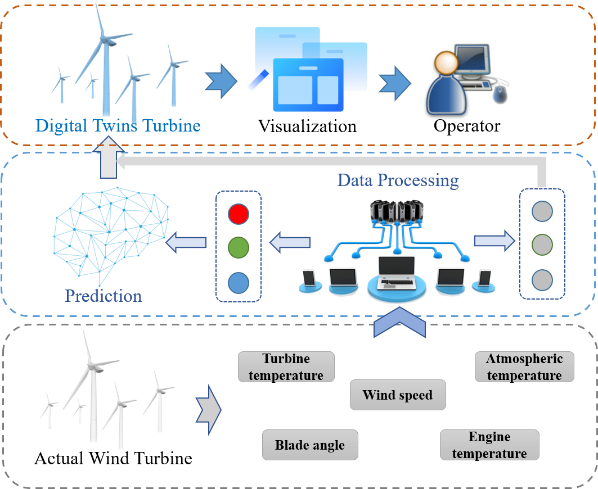
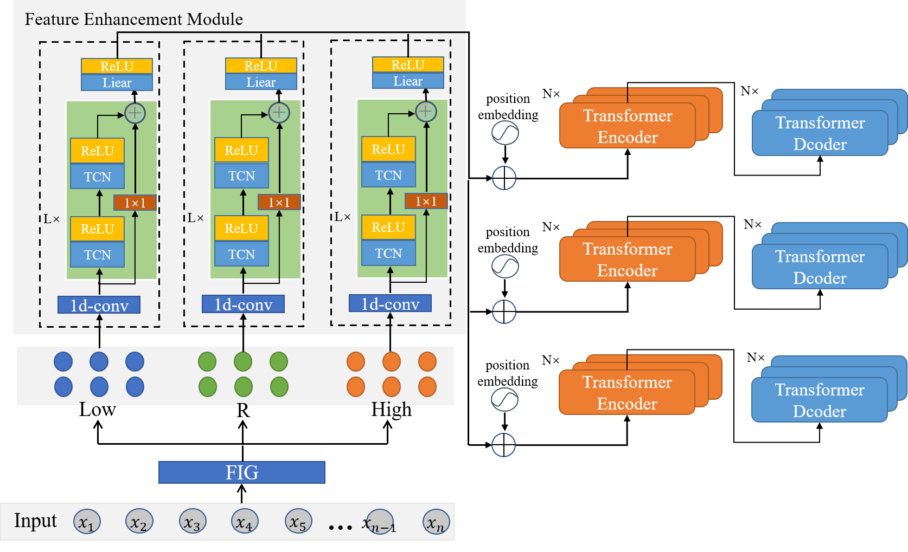

# Wind_Power_Predict
Visualization system for wind power forecasting

 ## Target

1. Real-time monitoring of key indicators and trends, and timely alarm when exceeding the standard.

2. Remote real-time monitoring to reduce the risk of information asymmetry.

3. The artificial intelligence model is integrated into the system to realize the intelligence of the system.

## Introduction

This system is built based on actual scene requirements. Embed the wind power prediction model into the system for power prediction, and the system displays the prediction results. In addition, in order to be able to monitor the working status of the wind power plant, the system can display various data in real time. In order to facilitate user operations, a variety of interactive methods have been added, which can switch the viewing angle and monitor the status of the specified windmill at fixed points. The system architecture is shown below.



The main interface of the system is as follows.


In this system, Transformer is used as the prediction model of the system, which can be replaced by itself. The model architecture is shown below.




## Environment

1. python >= 3.6

2. pytorch >= 1.9.0

3. Unity == 2019.4.14

## Quick Start
``` bash
# 1. clone from the repository
git clone https://github.com/join990/Wind-Power-Predict

# 2. Import the visualization system into Unity3D.
Project->import Package

# 3. inport the windpower predict model
python examples/base.py

# 4. run the windpower predict model

# 5. run the scenes

```


